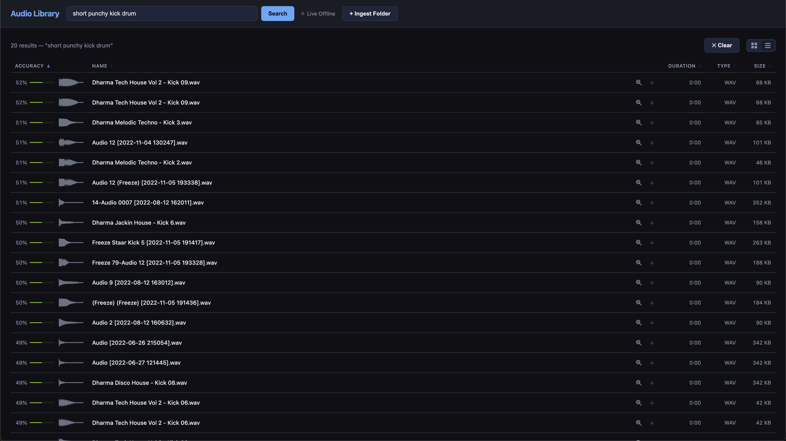
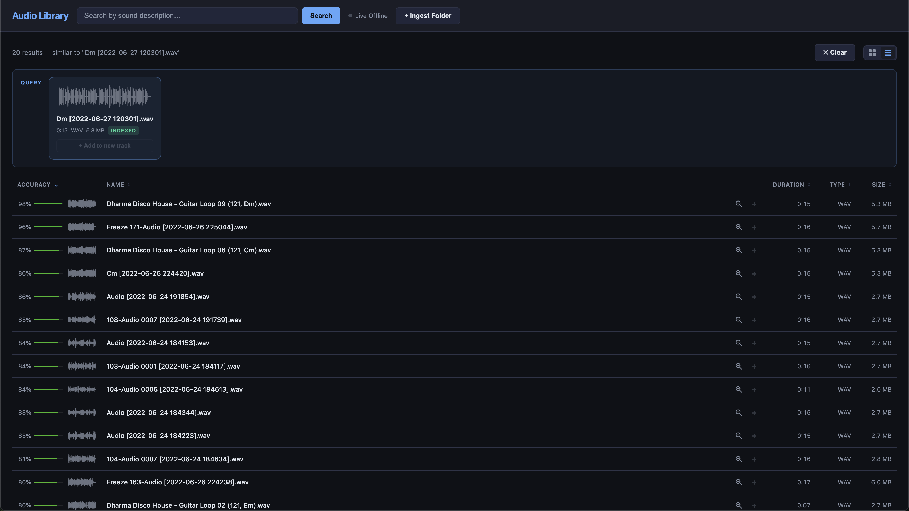
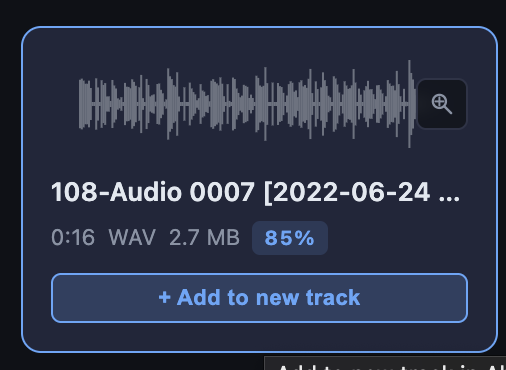

# Audio Library — Semantic Search for Sound Designers

A full-stack web app for music producers and sound designers that lets you browse, play, and **search your audio library using natural language**. Describe a sound ("warm bass stab with reverb", "snare with room ambience") and the app finds the closest matches by embedding both your query and every audio file into the same vector space using [CLAP](https://huggingface.co/laion/larger_clap_general) (Contrastive Language-Audio Pretraining). Also integrates directly with **Ableton Live** — load any file into a new track in one click.

---

## Features

- **Natural-language search** — type a description, get back the closest-matching sounds via cosine similarity in CLAP embedding space
- **Similar-sound discovery** — click any file to find others with a similar audio signature
- **Folder ingestion** — recursive scan of `.wav` / `.mp3` files with async background embedding via Celery
- **Waveform thumbnails** — lightweight canvas rendering from pre-computed peak arrays (no per-view audio decode)
- **Interactive playback** — WaveSurfer.js player with seek, play/pause, volume
- **Keyword search** — filter by filename, title, artist, album (SQL full-text)
- **Ableton Live integration** — load any file directly into a new MIDI track (Simpler) in a live session via OSC
- **Real-time progress** — ingestion status polling shows current stage, file count, and filename in progress

---

## Screenshots

**Description search** — natural language query ranked by CLAP embedding similarity


**Similarity search** — find sounds with a similar audio signature to a selected file


**Add to new Ableton track** — one-click load into a new Simpler track in a live session


**Ableton Live online** — real-time connection status indicator


---

## Architecture

```
┌──────────────────────────────────────────────────────┐
│              React 18 + Vite Frontend                │
│  App.jsx · AudioGrid · AudioCard · WaveformThumbnail │
│  AudioPlayer (WaveSurfer.js) · IngestPanel           │
└────────────────────┬─────────────────────────────────┘
                     │ HTTP  (Vite proxy /api → :8000)
┌────────────────────▼─────────────────────────────────┐
│              FastAPI Backend (:8000)                  │
│                                                        │
│  /api/files          list · metadata · stream audio   │
│  /api/files/{id}/similar   nearest-neighbor search    │
│  /api/search/text          CLAP text → vector search  │
│  /api/ingest               kick off + poll pipeline   │
│  /api/ableton/*            Live transport/tracks/OSC  │
└──┬──────────────────┬──────────────────┬──────────────┘
   │                  │                  │
   ▼                  ▼                  ▼ OSC / UDP
 SQLite            Qdrant            Ableton Live
 (metadata,        (CLAP             (AbletonOSC +
  waveform         embeddings,        custom Remote
  peaks)           cosine search)     Script bridge)

  Celery + Redis  ←  async ingestion pipeline
```

---

## Stack

| Layer | Technology |
|---|---|
| Frontend | React 18, Vite, WaveSurfer.js |
| API | FastAPI + Uvicorn |
| Background jobs | Celery + Redis |
| Metadata DB | SQLite (SQLAlchemy ORM) |
| Vector DB | Qdrant (embedded in-process — no Docker needed) |
| Embedding model | [CLAP](https://huggingface.co/laion/larger_clap_general) via HuggingFace Transformers |
| Audio processing | librosa (waveform peaks), soundfile, mutagen (ID3) |
| Ableton integration | python-osc (AbletonOSC), custom JSON/UDP Remote Script |

---

## Prerequisites

- **Python 3.11** (required — PyTorch has no macOS Intel wheels for 3.12+)
- Node.js 18+
- Redis — `brew install redis && brew services start redis`

---

## Setup

### 1. Start Redis

```bash
brew services start redis
```

### 2. Python environment

```bash
python3.11 -m venv .venv
source .venv/bin/activate

# PyTorch has no PyPI wheels for macOS Intel — must come from the PyTorch index
pip install torch torchaudio --index-url https://download.pytorch.org/whl/cpu

pip install -r requirements.txt
```

> **First run:** The CLAP model (~1 GB) downloads from HuggingFace the first time embeddings are generated, then caches to `~/.cache/huggingface`.

### 3. Frontend

```bash
cd frontend && npm install
```

---

## Running

**One command (recommended):**

```bash
./start.sh
```

This launches FastAPI, the Celery worker, and the Vite dev server together. `Ctrl-C` stops all three.

**Or manually (three terminals):**

```bash
# Terminal 1 — backend
source .venv/bin/activate && cd backend
uvicorn app.main:app --reload --port 8000

# Terminal 2 — Celery worker
source .venv/bin/activate && cd backend
celery -A app.celery_app:celery_app worker --loglevel=info --concurrency=1

# Terminal 3 — frontend
cd frontend && npm run dev
```

Open **http://localhost:5173**.

Click **+ Ingest Folder**, paste an absolute folder path, and hit **Start Ingestion**. Files appear as browsable cards immediately after the metadata phase. The `indexed` badge on each card lights up once CLAP embeddings are written to Qdrant.

---

## Configuration

Edit `config.yaml`:

```yaml
embedding:
  model_type: clap
  model_id: laion/larger_clap_general   # see options below
  device: cpu                            # cpu | cuda | mps (Apple Silicon)
  batch_size: 4

database:
  sqlite_path: ../data/audio.db

qdrant:
  mode: local                            # "local" (embedded) or "server"
  local_path: ../data/qdrant
```

**CLAP model options:**

| Model | Notes |
|---|---|
| `laion/larger_clap_general` | Recommended — best general-purpose accuracy |
| `laion/larger_clap_music` | Fine-tuned for music; better for melodic/harmonic queries |
| `laion/clap-htsat-unfused` | Lighter, faster; lower accuracy |

> **Apple Silicon:** set `device: mps` for ~10x faster embedding generation on M-series chips.

---

## Ableton Live Integration

The app ships with an Ableton Remote Script that opens a JSON/UDP socket on port 11002.

**Install the Remote Script:**

```bash
./install_ableton.sh
```

This copies `ableton_scripts/AudioWebApp/` into Ableton's MIDI Remote Scripts folder. Enable it in Ableton under **Preferences → MIDI → Control Surface → AudioWebApp**.

**What it enables:**
- `POST /api/ableton/add_to_simpler/{file_id}` — creates a new MIDI track and loads the audio file into Simpler
- Transport control (play, stop, tempo, record, metronome)
- Track management (create, delete, rename, volume, pan, mute, solo, arm)
- Device parameter control

The Live status indicator in the UI shows whether the Ableton connection is active.

---

## API Reference

| Method | Path | Description |
|---|---|---|
| `GET` | `/api/files` | List files (`?page=&page_size=&search=`) |
| `GET` | `/api/files/{id}` | Metadata + waveform peaks |
| `GET` | `/api/files/{id}/audio` | Stream audio (supports byte-range) |
| `GET` | `/api/files/{id}/similar` | Find similar sounds by embedding distance |
| `POST` | `/api/search/text` | Natural-language search via CLAP |
| `POST` | `/api/ingest` | Start folder ingestion (returns `task_id`) |
| `GET` | `/api/ingest/{task_id}` | Poll ingestion progress |
| `GET` | `/api/ableton/status` | Live connection health check |
| `POST` | `/api/ableton/add_to_simpler/{id}` | Load file into Ableton Simpler |

---

## Project Structure

```
audio-webapp/
├── backend/app/
│   ├── main.py              # FastAPI app, CORS, router registration
│   ├── config.py            # YAML config loader
│   ├── models.py            # AudioFile ORM schema
│   ├── ingestion.py         # File scan, metadata extraction, waveform peaks
│   ├── embeddings.py        # Abstract EmbeddingModel + CLAPModel implementation
│   ├── vector_store.py      # Qdrant wrapper (local / server mode)
│   ├── tasks.py             # Celery ingestion pipeline
│   ├── celery_app.py        # Celery configuration
│   ├── ableton.py           # AbletonOSC + AudioWebApp bridge client
│   └── routers/             # files · ingest · search · ableton
├── frontend/src/
│   ├── App.jsx              # Main orchestrator, state, search
│   ├── api.js               # Typed fetch wrapper for all endpoints
│   └── components/
│       ├── AudioGrid.jsx         # Paginated file browser
│       ├── AudioCard.jsx         # File card + waveform
│       ├── WaveformThumbnail.jsx # Canvas peak renderer
│       ├── AudioPlayer.jsx       # WaveSurfer player bar
│       └── IngestPanel.jsx       # Ingestion form + progress UI
├── ableton_scripts/AudioWebApp/  # Ableton Remote Script
├── config.yaml              # Model + DB + server config
├── requirements.txt
├── start.sh                 # One-command launcher
└── docker-compose.yml       # Optional Docker setup for Redis + Qdrant
```

---

## Dependency Notes (macOS Intel + Python 3.11)

| Package | Constraint | Reason |
|---|---|---|
| Python | **3.11** | No PyTorch macOS Intel wheels for 3.12+ |
| `torch` | from PyTorch index | Not available on PyPI for this platform |
| `llvmlite` | `==0.43.0` | Last version with a macOS Intel pre-built wheel |
| `numpy` | `<2.0` | torch 2.2 compiled against NumPy 1.x ABI |
| `transformers` | `<4.52` | 4.52+ enforces torch ≥ 2.6, unavailable on macOS Intel |
